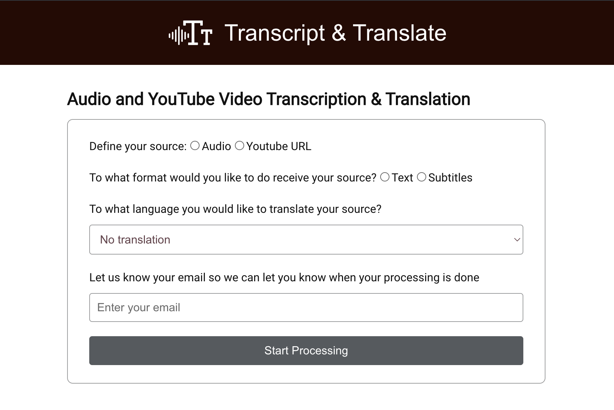

# Transcription and Translate your Media!

Tool to transcribe and/or translate videos from youtube and audios. You are able to download the result as a txt file. The field email is not required, but if you fill it out, it will send the result by email when the processment if finished. 



## What did I use to build this application?

- React: to build the frontend components
- Node.js and Express: to handle the backend
- yt-dlp: to download an audio from a youtube video
- openai: to transcript and transcribe the media
- Python3 and pip3: to run the scripts from the openai
- SASS and React Icons: to handle the style of the UI
- Playwright: to test and ensure the app is running

## How to use

1. Get your OpenAI API Key(https://platform.openai.com/account/api-keys)
2. Set an environment variable `$OPENAI_API_KEY` 
   
```bash
export OPENAI_API_KEY="yourkey"
``` 

3. Run the following commands:

```bash
pip3 install -r requirements.txt
npm i
npm run dev
```

4. Start the server:
    npm run devStart

5. Start the client:
    npm start

## Project Structure

```
PROJECT_ROOT
├── public   
├── src         
│   └── client             
│       └── components          # React components
│       └── styles              # SASS styles
│       └── api-client.js       # API routes
│       └── App.js
│    └── server
│       └── scripts             # Python scripts
│       └── execute-cmd.js      
│       └── index.js
│       └── send-email.js       
│    └── index.js
├── test                        # Playwright tests
├── tmp                         # Temporary files
```
