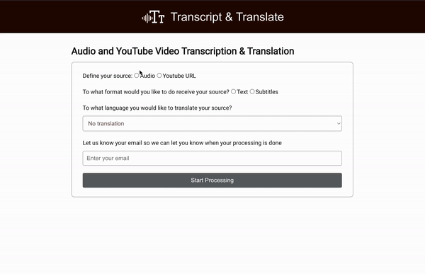
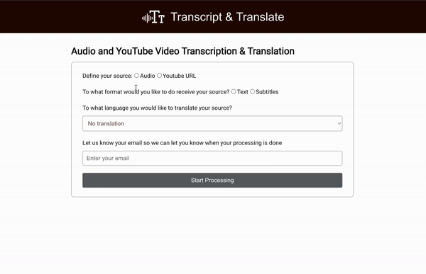

# Transcription and Translate your Media!

Tool to transcribe and/or translate videos from youtube and audio. You can download the result as a text file. The field email is not required, but if you fill it out, it will send the result by email when the processing is finished.

#### Youtube Source Example



#### Audio Source Example



## What did I use to build this application?

- React: to build the frontend components
- Node.js and Express: to handle the backend
- yt-dlp: to download audio from a youtube video
- express-fileupload: express middleware to upload files
- openai: to transcript and transcribe the media
- Python3 and pip3: to run the scripts from the openai
- SASS and React Icons: to handle the style of the UI
- Playwright: to test and ensure the app is running

## How to use

1. Create a .env file in the root directory
   
2. Get your OpenAI API Key (https://platform.openai.com/account/api-keys)

3. On your Google account > security: unable 2-Step Verification

4. On your Google account > security: create an app password and get the app password

6. On your .env file, define:

```bash
   EMAIL = "your gmail account"
   PASSWORD =  "app password"
   OPENAI_API_KEY="your key"
```

7. Install packages of the application (make sure you have python3 and pip3 installed on your machine):

```bash
   pip3 install -r requirements.txt
   npm i
```

8. Start the server (port 3000):

```bash
    npm run devStart
```

9. Start the client:

```bash
    npm start
```

## Project Structure

```
PROJECT_ROOT
├── public
├── src
│   └── client
│       └── components          # React components
│       └── styles              # SASS styles
│       └── api-client.js       # API routes
│       └── App.js
│    └── server
│       └── scripts             # Python scripts
│       └── execute-cmd.js
│       └── index.js
│       └── send-email.js
│    └── index.js
├── test                        # Playwright tests
├── tmp                         # Temporary files
```
